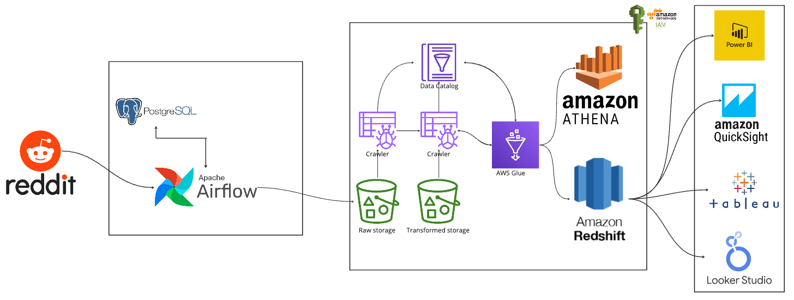

# Automated-Social-Media-Data-Analytics-Pipeline-with-Airflow-and-AWS-Redshift

Implemented an automated social media data analytics pipeline, utilizing Reddit API, Apache Airflow and AWS services, including AWS Glue and AWS Redshift. Elevated the project's impact by automating storage in an S3 bucket and enabling real-time analytics on Amazon Redshift, thereby enhancing data-driven decision-making capabilities.

**Overview :**
* Engineered social media data analysis pipeline for user persona analysis by automating **data ingestion** from the **Reddit API** through **Apache Airflow** for streamlined extraction.
* Implemented dynamic **ETL** processes using **AWS Glue**, optimizing data quality and structure for enhanced analytics.
* Automated storage in **AWS S3**, ensuring scalable data repository.
* Leveraged SQL queries in **AWS Athena** to facilitate seamless **data transformations** and accelerate query performance.
* Loaded transformed data into **Amazon Redshift**, establishing a **real-time analytics** environment.
* Elevated **data-driven** decision-making capabilities to facilitate strategic bussiness initiatives.

**Architecture :**

